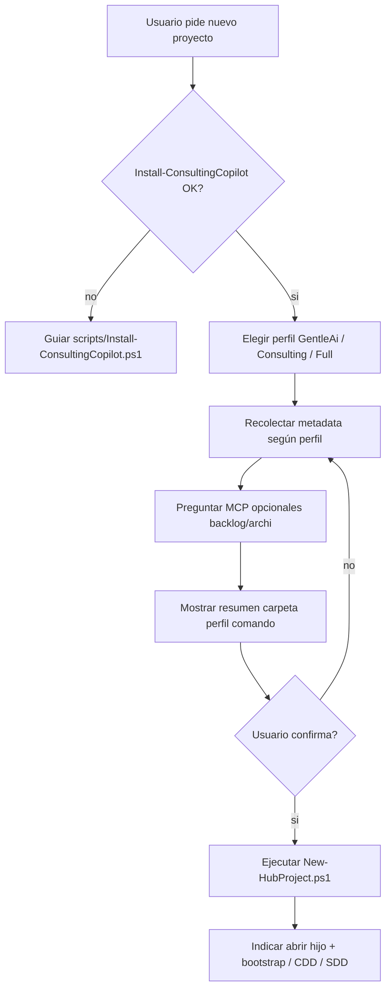

# Crear proyecto — Ingenia Hub

## Cuándo usar esta skill

- El workspace raíz es **`ingenia-hub-ia`** (hub), no un proyecto bajo `projects/`.
- El usuario quiere **generar un proyecto hijo** nuevo antes de iniciar bootstrap, CDD o SDD.

## Cuándo NO usar esta skill

- El workspace ya es una carpeta bajo `projects/` → usar `bootstrap-consulting-engagement` (Consulting/Full) o `/sdd-init` (GentleAi).
- El usuario pide editar entregables, SPEC o diagramas de un encargo existente.

## Antes de preguntar

1. Leer [`hub-registry.json`](../../../hub-registry.json) y listar `folderName` existentes para evitar duplicados.
2. Leer [`docs/STACK-PROFILES.md`](../../../docs/STACK-PROFILES.md) para explicar perfiles sin inventar.
3. **No** editar `skeleton/` ni `overlays/` durante la creación de un hijo.

## Flujo conversacional



### 1. Prerrequisitos

Verificar que el usuario ejecutó setup global según el perfil elegido:

```powershell
Set-Location "ruta\a\ingenia-hub-ia\scripts"
.\Install-ConsultingCopilot.ps1 -StackProfile Full   # o GentleAi / Consulting
```

Si falta `gentle-ai` o `engram` (Full/GentleAi), guiar la instalación antes de continuar.

### 2. Elegir perfil

| Perfil | Para quién |
|--------|------------|
| **Consulting** | Solo consultoría (entregables, diagramas, ArchiMate) |
| **Full** | Consultoría + Gentle AI (CDD, Engram) |
| **GentleAi** | Solo desarrollo (SDD, Engram) |

### 3. Recolectar metadata

#### Consulting / Full

| Campo | Ejemplo | Uso |
|-------|---------|-----|
| Cliente (display) | IPLAN | Tokens y títulos |
| Slug cliente | iplan | Carpeta: `projects/iplan-u01/` |
| Iniciativa (display) | Gobierno de APIs | Tokens |
| Código iniciativa | U01 | Sufijo de carpeta (minúsculas) |
| MCP backlog | S/N | Backlog.md MCP |
| MCP archi | S/N | archi-server MCP |

Carpeta por defecto: `projects/{client-slug}-{initiative-id}/` (ej. `iplan-u01`).

#### GentleAi

| Campo | Ejemplo |
|-------|---------|
| Nombre del proyecto | mi-api-interna |
| Carpeta (opcional) | `-ProjectFolderName` si el slug automático no alcanza |

### 4. Confirmación explícita

Mostrar resumen antes de ejecutar PowerShell:

- Perfil elegido
- `folderName` calculado (y verificar que no esté en `hub-registry.json`)
- Ruta absoluta esperada bajo `projects/`
- Comando exacto a ejecutar

**No ejecutar el script sin confirmación explícita del usuario.**

### 5. Ejecutar generación

Desde `scripts/` del hub:

```powershell
# Consulting / Full
.\New-HubProject.ps1 `
  -StackProfile Full `
  -ClientDisplayName "IPLAN" -ClientSlug "iplan" `
  -InitiativeDisplayName "Gobierno de APIs" -InitiativeId "U01" `
  -IncludeBacklogMcp -IncludeArchiMcp

# GentleAi
.\New-HubProject.ps1 `
  -StackProfile GentleAi `
  -ProjectName "mi-api-interna"
```

Override de carpeta: `-ProjectFolderName "nombre-custom"`.

### 6. Handoff (obligatorio)

Tras generar, **detenerse**. El hub no continúa el bootstrap del encargo.

Indicar al usuario:

1. **Abrir** `projects/<nombre>/` como workspace raíz en Cursor (paso crítico para MCP). El script intenta abrir Cursor con `cursor <ruta>` salvo `-SkipOpenCursor`.
2. Ejecutar **`/onboarding`** en el hijo para recorrido guiado (workspace, MCP, próximos pasos).
3. Seguir **`docs/GETTING-STARTED.md`** en el hijo — checklist generada automáticamente con pasos por perfil.
4. Copiar plantilla Word a `docs/templates/` (Consulting/Full).

## Reglas

- Leer `hub-registry.json` antes de proponer un `folderName`.
- No duplicar preguntas ya respondidas en el mismo hilo.
- No modificar `skeleton/` ni `overlays/` al crear un hijo.
- Si el usuario pide ruta fuera de `projects/`, advertir que el `.gitignore` del hub no la excluye; la convención canónica es `projects/<nombre>/`.
