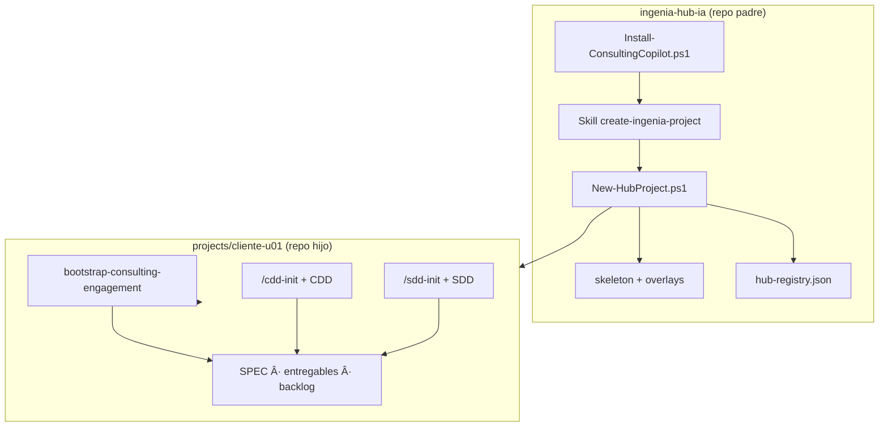

# Flujo de trabajo — Ingenia Hub IA

Checklist operativo para recorrer el hub desde la creación de un proyecto hasta el trabajo diario en el encargo. Complementa [`README.md`](README.md).

## Vista general



---

## Fase 0 — Preparar el hub (una vez)

| Paso | Acción | Dónde |
|------|--------|-------|
| 1 | Clonar o abrir `ingenia-hub-ia` como **workspace raíz** | Raíz del repo |
| 2 | Ejecutar setup global según perfiles que usarás | `scripts/Install-ConsultingCopilot.ps1` |
| 3 | Verificar MCP y herramientas | [MCP-PREREQUISITOS.md](MCP-PREREQUISITOS.md) |

```powershell
Set-Location "ruta\a\ingenia-hub-ia\scripts"
.\Install-ConsultingCopilot.ps1 -StackProfile Full
```

---

## Fase 1 — Crear proyecto hijo

| Paso | Acción | Dónde |
|------|--------|-------|
| 1 | Pedir nuevo proyecto en Cursor o invocar script | Skill `create-ingenia-project` o `New-HubProject.ps1` |
| 2 | Confirmar perfil, cliente/slug, iniciativa (Consulting/Full) o nombre (GentleAi) | Chat o parámetros PS |
| 3 | Revisar resumen: carpeta `projects/<nombre>/`, perfil, MCP | Antes de ejecutar |
| 4 | Ejecutar generación | `scripts/New-HubProject.ps1` |
| 5 | Verificar registro | `hub-registry.json` |

**Convención de carpeta:** `projects/{client-slug}-{initiative-id}/` (ej. `iplan-u01`).

**Validaciones post-creación:**

- [ ] Existe `projects/<nombre>/` con skeleton y overlay correcto
- [ ] Existe `projects/<nombre>/.git/`
- [ ] Entrada en `hub-registry.json`
- [ ] `git status` en el **padre** no lista el hijo (gitignore activo)

---

## Fase 2 — Abrir el hijo como workspace

| Paso | Acción |
|------|--------|
| 1 | File → Open Folder → `projects/<nombre>/` (o dejar que el script abra Cursor con `cursor <ruta>`) |
| 2 | Ejecutar **`/onboarding`** o leer **`docs/GETTING-STARTED.md`** |
| 3 | Confirmar que las reglas del encargo (no del hub) están activas |
| 4 | Cursor Settings → MCP — verificar `engram` y demás servidores en verde |
| 5 | Ajustar rutas en `.cursor/mcp.json` si hay placeholders (archi, backlog) |

> **Importante:** no trabajes entregables de cliente con el workspace en la raíz del hub. Los MCP del hijo (Engram, etc.) **no cargan** mientras el workspace sea el padre.

---

## Fase 3 — Bootstrap del encargo

Según perfil generado:

### Consulting / Full

| Paso | Acción |
|------|--------|
| 1 | Skill **`bootstrap-consulting-engagement`** — completar README, SPEC, ARCHITECTURE |
| 2 | Copiar plantilla Word corporativa a `docs/templates/` |
| 3 | Configurar exports ArchiMate según metadata en `.consulting-engagement.json` |

### Full (adicional)

| Paso | Acción |
|------|--------|
| 1 | `/cdd-init` — inicializar flujo CDD |
| 2 | `/cdd-new <entregable>` — primer ciclo de diseño |

### GentleAi

| Paso | Acción |
|------|--------|
| 1 | `/sdd-init` — inicializar flujo SDD |
| 2 | `/sdd-new <cambio>` — primer cambio |

---

## Fase 4 — Trabajo cotidiano (en el hijo)

Flujo típico de consultoría (Consulting/Full):

```mermaid
flowchart LR
  A[Reuniones / material cliente] --> B[transcripts/ · docs/client-documentation/]
  B --> C[Canónicos SPEC · ARCHITECTURE · ArchiMate]
  C --> D[backlog · meetings/]
  C --> E[docs/draft/]
  E --> F[docs/deliverables/]
```



Reglas clave en el hijo:

- **`transcripts/`** — inmutable salvo confirmación explícita
- **`docs/deliverables/`** — sin referencias internas al repo
- Canónicos antes que borradores de cliente

Skills útiles en el día a día (Consulting/Full):

- **`architect-copilot`** — estado del encargo, prioridades, bloqueos
- **`transcription-to-actions`** — derivar backlog/gaps desde `transcripts/`
- **`draft-client-deliverable`** — redactar material que saldrá al cliente

---

## Retroalimentación al template (hub)

| Qué | Dónde | Notas |
|-----|-------|-------|
| Mejoras al molde | `skeleton/`, `overlays/` en **ingenia-hub-ia** | Commitear en el padre |
| Lecciones de un encargo | Portar manualmente al skeleton | No hay auto-sync a hijos existentes |
| Nuevo hijo | `New-HubProject.ps1` | Hereda el template actual |

**Fuera de v1:** sincronización automática de mejoras del template hacia proyectos ya generados.

---

## Catálogo y trazabilidad

| Fuente | Contenido |
|--------|-----------|
| [`hub-registry.json`](hub-registry.json) | Proyectos generados desde el hub (máquina) |
| Git de cada hijo | Historial del encargo |
| Git del padre | Evolución del template (sin `projects/`*) |

---

## Troubleshooting

| Problema | Solución |
|----------|----------|
| Carpeta destino no vacía | Vaciar, usar `-Force`, o `-ProjectFolderName` distinto |
| `folderName` duplicado en registry | Elegir otro nombre o `-Force` |
| Hijo aparece en `git status` del padre | Debe estar bajo `projects/`; revisar `.gitignore` |
| `gentle-ai` no encontrado | `Install-ConsultingCopilot.ps1 -StackProfile Full` |
| Quiero ruta custom fuera de `projects/` | Usar `New-ConsultingCopilotProject.ps1` directo; advertencia: sin gitignore automático |

---

## Checklist rápido

**Crear encargo Consulting/Full**

- [ ] Setup global en hub
- [ ] Skill o script → proyecto en `projects/`
- [ ] Abrir hijo como workspace
- [ ] `bootstrap-consulting-engagement`
- [ ] (Full) `/cdd-init`
- [ ] Plantilla Word en `docs/templates/`

**Crear app GentleAi**

- [ ] Setup global con perfil GentleAi
- [ ] `New-HubProject.ps1 -StackProfile GentleAi`
- [ ] Abrir hijo → `/sdd-init`
