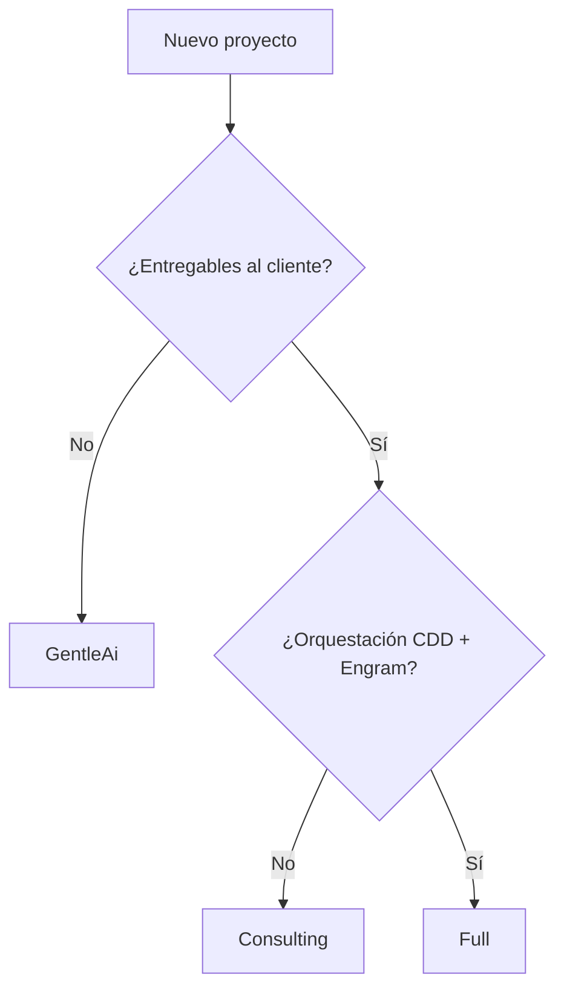

# Perfiles de stack — Consulting Copilot

Consulting Copilot soporta tres perfiles seleccionables al crear un proyecto.

## Resumen

| Perfil | Script | Metadata | Orquestación |
|--------|--------|----------|--------------|
| **GentleAi** | `-StackProfile GentleAi` | `.project-profile.json` | SDD vía `gentle-ai install --scope workspace` |
| **Consulting** | `-StackProfile Consulting` | `.consulting-engagement.json` | Skills/reglas de dominio, sin CDD |
| **Full** | `-StackProfile Full` | `.consulting-engagement.json` (`stackProfile: full`) | `gentle-ai install` (SDD + Engram) + overlay CDD |

## Setup global (una vez)

```powershell
cd ingenia-hub-ia\scripts
.\Install-ConsultingCopilot.ps1 -StackProfile Full
```

Valida: `gentle-ai`, `engram`, Node, Pandoc (opcional), Backlog.md (opcional).

## Crear proyecto por cliente

Desde **ingenia-hub-ia**, el método canónico es `New-HubProject.ps1` (genera en `projects/` y registra en `hub-registry.json`):

```powershell
# Solo consultoría
.\New-HubProject.ps1 `
  -StackProfile Consulting `
  -ClientDisplayName "IPLAN" -ClientSlug "iplan" `
  -InitiativeDisplayName "Gobierno de APIs" -InitiativeId "U01"

# Full (CDD + consultoría)
.\New-HubProject.ps1 `
  -StackProfile Full `
  -ClientDisplayName "IPLAN" -ClientSlug "iplan" `
  -InitiativeDisplayName "Gobierno de APIs" -InitiativeId "U01"

# Solo desarrollo
.\New-HubProject.ps1 `
  -StackProfile GentleAi `
  -ProjectName "mi-app"
```

Retrocompat: `New-ConsultingCopilotProject.ps1` acepta `-TargetPath` absoluto custom; `New-IngeniaTemplateProject.ps1` equivale a `-StackProfile Consulting`.

## Después de crear

1. Abrí la carpeta destino como **workspace raíz** en Cursor.
2. Revisá `.cursor/mcp.json`.
3. Perfil **Consulting/Full**: usá skill `bootstrap-consulting-engagement` para completar SPEC.
4. Perfil **Full**: ejecutá `/cdd-init`, luego `/cdd-new <entregable>`.
5. Perfil **GentleAi**: ejecutá `/sdd-init`, luego `/sdd-new <cambio>`.

## Reglas activas por perfil

```
Consulting:
  consulting-copilot.mdc
  + reglas skeleton (deliverables, ArchiMate, transcripts)

Full:
  gentle-ai.mdc (instalado por gentle-ai install)
  + consulting-copilot.mdc
  + gentle-ai-consulting.mdc (orquestador CDD)
  + skills/agents cdd-* (overlay) y sdd-* (gentle-ai install)

GentleAi:
  gentle-ai.mdc (instalado por gentle-ai install --scope workspace)
```

## Metadata

- **`.consulting-engagement.json`** — cliente, iniciativa, MCP toggles, `stackProfile`
- **`.project-profile.json`** — solo perfil GentleAi
- **`.workbench-metadata.json`** — retrocompat (bootstrap skill lo lee como fallback)

## Troubleshooting

| Problema | Solución |
|----------|----------|
| Engram no conecta | Verificar `engram` en PATH y servicio activo (`gentle-ai doctor`) |
| MCP drawio falla | Node LTS + `npx @drawio/mcp` |
| CDD no aparece | Confirmar `stackProfile: full` en metadata y presencia de `overlays/full/` |
| Skill registry vacío | `gentle-ai skill-registry refresh --force` en el repo del proyecto |
| Placeholders `{{` sin reemplazar | Re-ejecutar script con todos los parámetros de cliente |

## Diagrama de decisión


